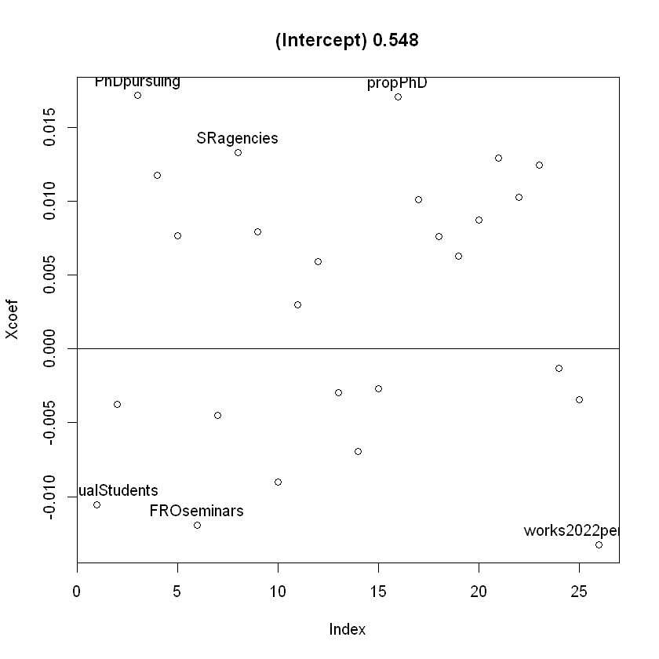

# Parsimonious Deeper Learning with Research Data from Top 20 (2022-Sept-05)
Building on earlier analyses, this [author](mailto:yadevinit@gmail.com) here attempts parsimonious regression by properly reducing the (dimensionality of) factors that institutions need to consider for raising `Score`. This uses [PLSR and PCR](http://www.science.smith.edu/~jcrouser/SDS293/labs/lab11-r.html): Partial Least Squares (or Projection onto Latent Structures) Regression and Principal Components Regression. Here are the highlights for those who wish to scrutinize the models, rather than simply use the models directly. Those readers may compare with "mental models" of interacting variables and response impact. So, the following highlights are for readably assisting institutional stakeholders to re-orient their strategies considering expected impact of (latent components of) variables:

1.    Response `Score`---expressed on scale of `0` to `1`---and over 25 variables have been standardized so that their (unit) impacts can be numerically compared. About 90% of their variance is explained by "latent" components, as per the chosen count of 5 components.
2.    Under the headings ahead, there are code-session extracts which shrink the component-wise variables to show only those with greater impact from their `loadings`. Here's a guide to interpret those components as per PLSR extract, unless stated otherwise:
      +    PLSR-identified component `Comp 1` clubs (highlighted) Financial-Resources Operating expenses `FROcost` and amounts from Sponsored-Research (and Consultancy) projects `SRCrevenue`. This is similar to PCR-identified `Comp 1`.
      +    `Comp 2` shows negative `loadings` impact from count of students `UGactualStudents` (undergraduate as well as `UGPGPhD`) as well as `faculty` on `Score`. This shows up through both PLSR and PCR. PLSR component also shows adverse impacts of Consultancy projects `Cprojects` and Organizations `Corgs`, though not in PCR's `Comp 2`.
      +    `Comp 3` positively impacts via count of `faculty`, along with count of students `UGPGPhD` (and `PGactualStudents`). Citations per Work `TCperWork2022` (and `TCperWork2021`) impact negatively within the same component.
      +    `Comp 4` impacts positively via count of Consultancy Organizations `Corgs` and projects `Cprojects`. `PGactualStudents` impacts negatively.
      +    `Comp 5` positively impacts via Citations per Work `TCperWork2021` (and `TCperWork2022`) and Count of Citations `TC2021`.
      +    PCR-identified `Comp 5` negatively clubs (a) (highlighted) count of Works per faculty `works2022perFaculty`---"publication productivity" across 3 years lagged by 2 years---with (b) the count of publications `works_count2021` (and `works_count2022`, across all faculty for each given institution). Their negative `loadings` indicate their adverse impact on `Score`. In contrast within the same component, unit rise in Citations per Work `TCperWork2021` (and `TCperWork2022`) positively impacts `Score`, just as in PLSR-identified `Comp 5`.
   
3.    Under the headings ahead, there are also plots of (regression) coefficients for each explanatory variable. These impacts on response `Score` seem easier to interpret though they do not show (latent) components.
      +   The PLSR coefficients' plot shows biggest (standardized) impact from: `works2022perFaculty: -0.0133 FROseminars: -0.012 UGactualStudents: -0.0105 SRagencies: 0.0133 propPhD: 0.0171 PhDpursuing: 0.0172`. Here, `FROseminars` denotes NIRF-reported "Financial-Resources Utilised Amount for the Operational expenditure for previous 3 years for Seminars/Conferences/Workshops".
      +   The PCR coefficients' plot shows biggest impact from: `Cprojects: -0.0044 Corgs: -0.0036 UGactualStudents: -0.0022 SRamount: 0.0084 SRprojects: 0.0086 FROmtce: 0.0092`. Here, `FROmtce` denotes NIRF-reported "Financial-Resources Utilised Amount for the Operational expenditure for previous 3 years for Maintenance of Academic Infrastructure or consumables and other running expenditures (excluding maintenance of hostels and allied services, rent of the building, depreciation cost, etc)".

The code-session extracts referred to are under headings ahead. They have been extracted from an (updated) Jupyter Notebook with `R` code which is at [`inNIRF.ipynb`](./worldClass/inNIRF-2022Sept05-1813.ipynb). Regarding [Works](https://docs.openalex.org/):

>    Works are papers, books, datasets, etc; they *cite* other works.

## PLSR Extract

## PCR Extract

