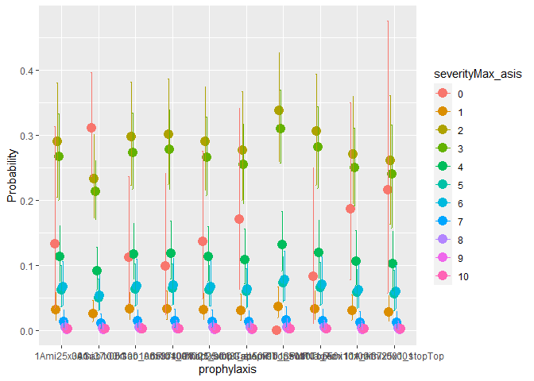
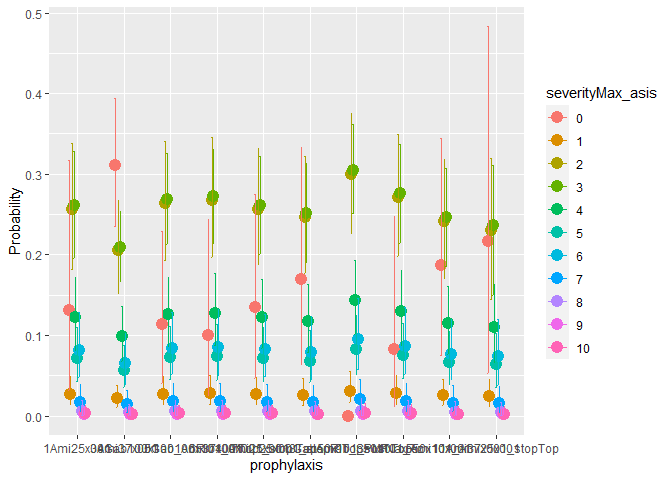
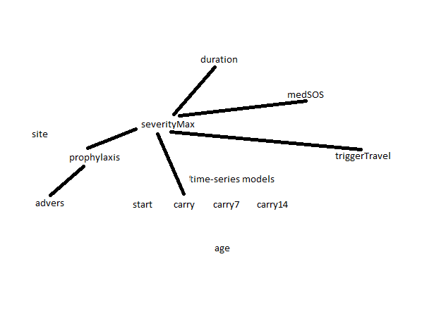

```{r setup, include=FALSE}
knitr::opts_chunk$set(echo = TRUE)
# knitr::opts_chunk$set(cache = TRUE) # , cache.path='cache/')
knitr::opts_chunk$set(error=FALSE)
  # so that knitr stops upon error and traceback() works ... ie for debugging.
  # ref https://stackoverflow.com/questions/19286051/some-plots-not-rendering-in-rstudio-knitr-rmarkdown
```

## Synopsis
[What Really Matters in Future with a Migraine History] shared descriptive statistics of a [headache diary], findings, and a way forward. It also suggested further statistical analysis. Building on that, this research viewpoint shares code-session outputs from related Bayesian modeling. Essentially, the models are Cumulative-distribution ordinal models---some with a hurdle for excess zeroes---where the response is either `severityMax_asis` (daily maximum of headache severity on a scale of `[0,1--10]` with model name prefixed with `sev09.*` to indicate 9 thresholds) or `severityMaxGrp` (grouped into three ordinal categories with model name prefixed with `sev02.*` to indicate 2 thresholds). Here are salient points considering [Appendix on Bayesian Modeling Session](#markdown-header-appendix-on-bayesian-modeling-session) of selected models:

1. Prescribed `prophylaxis` regime `3Ami37x001`---and maybe `7Top25x001_stopRib_SPMF` and `10Top50x101_Ami25x001`---shows relatively-superior estimates for probability of nil and low-severity headaches, while holding co-variates adversity `advers`, travel trigger `triggerTravel_fac`, and `carry` (for week-long regime-transition effects) at their baseline or mean values. `prophylaxis` `11Ami37x001_stopTop` could evolve to be similar to `3Ami37x001`, though presently its mean estimate might show a wider Credible Interval. These conditional effects are plotted as follows, from different models:





2. `Rhat > 1.05` and the chain-wise estimates for `b_hu_prophylaxis8Top50x101_sosNaxRiz` indicate that this hurdle-coefficient estimate is quite uncertain; parts of those models did not converge. That can be explained given this regime's low (observed) incidence of nil (`0` severity) headache days (and high presence of high-severity days). Overall, this `prophylaxis` regime shows relatively the least-effective probability estimates, though medical practitioners expect this regime's higher dose to be superior to the previous `7Top25x001_stopRib_SPMF`.

3. This viewpoint uses `R`-package [`brms`: Bayesian Regression Models using 'Stan'] and its vignettes; and [testing `hurdle_cumulative` family] illustrates the rationale of its modeling. To ease extensibility, the accompanying `R`-source code has comments and www URLs that this [author](mailto:yadevinit@gmail.com) used to learn (re-)thinking Bayesian, e.g., at `sevdura-helper.R`. This author did attempt (ARMA) time-series modeling---including with a Bernoulli presence of headache---and did not find merit in including it further into multilevel modeling. That exercise is not reported in this viewpoint, but the source code supports it, e.g., via the modeling specifications in `bayeSpec.csv` using which the models can be almost-automatically updated---in about half an hour on an Intel Core i3 1.7GHz---with the latest data. One could extend this project by:

    + consulting domain expertise for different priors, e.g., for `b_hu_prophylaxis8Top50x101_sosNaxRiz`,
    + dealing with the observations identified through (Pareto smoothed importance sampling) PSIS diagnostics, which seem to transition suddenly from or to high severity,
    + explaining the substantially-different (nil-headache) probability estimates for `3Ami37x001` given by the `sev09.` and `sev02.` models here,
    + testing specific hypotheses, e.g., whether any particular `prophylaxis` regime is indeed better than other regimes, and if so, to what extent,
    + considering a multivariate response, e.g., by including headache duration `durationH`, and
    + exploring suitability of distributions used for parameters such as `mu`.

4. Here are few diagnostic points on the models selected for this viewpoint:

    + Model `sev09.02` `pp_check()` reveals observed peaks were typically exceeded, except for `severity 0`; correspondingly, observed `T(y)` missed `T(yrep)`. For `sev09.02.1`, plots reveal better fits. For the more-complex model `sev09.02.1.tf.ca`, fit is reasonable, but variance seems higher for `severity 2` and gap seems to emerge between (latent) continuous fit and the discrete observations; also, `stat_2d` plot seems to indicate a `mean-sd` association.
    + Fits seem alright for `sev02.02.1pro`, whose goodness is similar to that of the simpler model `sev02.02`.

5. For the underlying reasoning chain, here's this viewpoint's conceptual network as a directed acyclic graph:

Though arrows are not marked, the reader can imagine arrows pointing upward, i.e., along the lined edges and towards nodes that are higher.

## Appendix on Bayesian Modeling Session
```{r init}
# 
# 
cRoot <- file.path(c(".", "../Downloads/sevDura")[1]) # [1] knit; [2] console
c.patn.n <- c("^sev02[.]02.*", "^sev09[.]02.*", "^sev02[.]02.*|^sev09[.]02.*")
source(file.path(cRoot, "sevdura.R"))
```


```{r exit}
date()
sessionInfo()
```

[What Really Matters in Future with a Migraine History]: <https://colab.research.google.com/drive/1_gZRvPrNDkK514eVzOxEgWdU9R3ccj6N>
[headache diary]: <https://docs.google.com/spreadsheets/d/1yZ1dzq_yoPYms7pENiPyIpXWY5po8IeSKFvzmkUmqyA/edit?usp=sharing>
[`brms`: Bayesian Regression Models using 'Stan']: <https://cran.r-project.org/package=brms>
[testing `hurdle_cumulative` family]: <https://htmlpreview.github.io/?raw.githubusercontent.com/sjwild/hurdle_ordered/main/test_supported_hurdle_cumulative_family.html>
