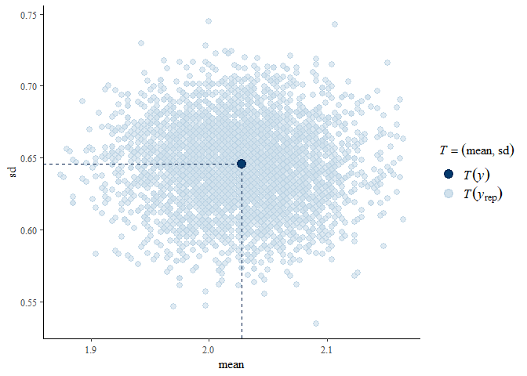

Migraine Diary Bayesian
================
<yadevinit@gmail.com>
last revised 2024-January-29 at 17:49

## Synopsis

[What Really Matters in Future with a Migraine
History](https://colab.research.google.com/drive/1_gZRvPrNDkK514eVzOxEgWdU9R3ccj6N)
shared descriptive statistics of a [headache
diary](https://docs.google.com/spreadsheets/d/1yZ1dzq_yoPYms7pENiPyIpXWY5po8IeSKFvzmkUmqyA/edit?usp=sharing),
findings, and a way forward. It also suggested further statistical
analysis. Building on that, this research viewpoint shares code-session
outputs from related Bayesian modeling. Essentially, the models are
Cumulative-distribution ordinal models—some with a hurdle for excess
zeroes—where the response is either `severityMax_asis` (daily maximum of
headache severity on a scale of `[0,1--10]` with model name prefixed
with `sev09.*` to indicate 9 thresholds) or `severityMaxGrp` (grouped
into three ordinal categories with model name prefixed with `sev02.*` to
indicate 2 thresholds). Here are salient points considering [Appendix on
Bayesian Modeling
Session](#markdown-header-appendix-on-bayesian-modeling-session) of
selected models:

1.  Prescribed `prophylaxis` regime `3Ami37x001`—and maybe
    `7Top25x001_stopRib_SPMF` and `10Top50x101_Ami25x001`—shows
    relatively-superior estimates for probability of nil and
    low-severity headaches, while holding co-variates adversity
    `advers`, travel trigger `triggerTravel_fac`, and `carry` (for
    week-long regime-transition effects) at their baseline or mean
    values. `prophylaxis` `11Ami37x001_stopTop` could evolve to be
    similar to `3Ami37x001`, though presently its mean estimate might
    show a wider Credible Interval. These conditional effects are
    plotted as follows, from different models:
    


2.  `Rhat > 1.05` and the chain-wise estimates for
    `b_hu_prophylaxis8Top50x101_sosNaxRiz` indicate that this
    hurdle-coefficient estimate is quite uncertain; parts of those
    models did not converge. That can be explained given this regime’s
    low (observed) incidence of nil (`0` severity) headache days (and
    high presence of high-severity days). Overall, this `prophylaxis`
    regime shows relatively the least-effective probability estimates,
    though medical practitioners expect this regime’s higher dose to be
    superior to the previous `7Top25x001_stopRib_SPMF`.

3.  This viewpoint uses `R`-package [`brms`: Bayesian Regression Models
    using ‘Stan’](https://cran.r-project.org/package=brms) and its
    vignettes; and [testing `hurdle_cumulative`
    family](https://htmlpreview.github.io/?raw.githubusercontent.com/sjwild/hurdle_ordered/main/test_supported_hurdle_cumulative_family.html)
    illustrates the rationale of its modeling. To ease extensibility,
    the accompanying `R`-source code has comments and www URLs that this
    [author](mailto:yadevinit@gmail.com) used to learn (re-)thinking
    Bayesian, e.g., at `sevdura-helper.R`. This author did attempt
    (ARMA) time-series modeling—including with a Bernoulli presence of
    headache—and did not find merit in including it further into
    multilevel modeling. That exercise is not reported in this
    viewpoint, but the source code supports it, e.g., via the modeling
    specifications in `bayeSpec.csv` using which the models can be
    almost-automatically updated—in about half an hour on an Intel Core
    i3 1.7GHz—with the latest data. One could extend this project by:

    - consulting domain expertise for different priors, e.g., for
      `b_hu_prophylaxis8Top50x101_sosNaxRiz`,
    - dealing with the observations identified through (Pareto smoothed
      importance sampling) PSIS diagnostics, which seem to transition
      suddenly from or to high severity,
    - explaining the substantially-different (nil-headache) probability
      estimates for `3Ami37x001` given by the `sev09.` and `sev02.`
      models here,
    - testing specific hypotheses, e.g., whether any particular
      `prophylaxis` regime is indeed better than other regimes, and if
      so, to what extent,
    - considering a multivariate response, e.g., by including headache
      duration `durationH`, and
    - exploring suitability of distributions used for parameters such as
      `mu`.

4.  Here are few diagnostic points on the models selected for this
    viewpoint:

    - Model `sev09.02` `pp_check()` reveals observed peaks were
      typically exceeded, except for `severity 0`; correspondingly,
      observed `T(y)` missed `T(yrep)`. For `sev09.02.1`, plots reveal
      better fits. For the more-complex model `sev09.02.1.tf.ca`, fit is
      reasonable, but variance seems higher for `severity 2` and gap
      seems to emerge between (latent) continuous fit and the discrete
      observations; also, `stat_2d` plot seems to indicate a `mean-sd`
      association.
    - Fits seem alright for `sev02.02.1pro`, whose goodness is similar
      to that of the simpler model `sev02.02`.

5.  For the underlying reasoning chain, here’s this viewpoint’s
    conceptual network as a directed acyclic graph: 
    Though arrows are not marked, the reader can imagine arrows pointing
    upward, i.e., along the lined edges and towards nodes that are
    higher.

## Appendix on Bayesian Modeling Session

``` r
# 
# 
cRoot <- file.path(c(".", "../Downloads/sevDura")[1]) # [1] knit; [2] console
c.patn.n <- c("^sev02[.]02.*", "^sev09[.]02.*", "^sev02[.]02.*|^sev09[.]02.*")
source(file.path(cRoot, "sevdura.R"))
```

    ## [1] "Mon Jan 29 17:49:27 2024"

    ## Loading required package: ggplot2

    ## Loading required package: brms

    ## Warning: package 'brms' was built under R version 4.3.2

    ## Loading required package: Rcpp

    ## Loading 'brms' package (version 2.20.4). Useful instructions
    ## can be found by typing help('brms'). A more detailed introduction
    ## to the package is available through vignette('brms_overview').

    ## 
    ## Attaching package: 'brms'

    ## The following object is masked from 'package:stats':
    ## 
    ##     ar

    ## Loading required package: zoo

    ## 
    ## Attaching package: 'zoo'

    ## The following objects are masked from 'package:base':
    ## 
    ##     as.Date, as.Date.numeric

    ## 'data.frame':    366 obs. of  26 variables:
    ##  $ date               : Date, format: "2023-01-27" "2023-01-28" ...
    ##  $ site               : chr  "Frontallr" "Temporall" "Frontale" "Frontal" ...
    ##  $ severityMin        : int  1 NA NA NA NA NA NA NA NA NA ...
    ##  $ severityMax        : Ord.factor w/ 11 levels "0"<"1"<"2"<"3"<..: 7 7 4 3 3 1 3 5 4 1 ...
    ##  $ durationH          : num  8 4 6 4 3 0 3 5 5 0 ...
    ##  $ start24H           : int  NA NA NA NA NA NA NA NA NA NA ...
    ##  $ remark             : chr  "bifrontal" "" "" "" ...
    ##  $ prescription       : chr  "1Ami25x001" "1Ami25x001" "1Ami25x001" "1Ami25x001" ...
    ##  $ medication         : chr  "" "Naxdom" "" "" ...
    ##  $ triggerTravel      : chr  "" "" "" "" ...
    ##  $ siteTemp           : Factor w/ 3 levels "0nil","FrontalsnoTemporal",..: 2 3 2 2 2 1 2 2 2 1 ...
    ##  $ medication_fac     : chr  "0nil" "Naxdom" "0nil" "0nil" ...
    ##  $ triggerTravel_fac  : Factor w/ 2 levels "0nil","yes": 1 1 1 1 1 1 1 2 1 1 ...
    ##  $ sevDura            : num  5.53 4.87 3.1 2.07 1.9 ...
    ##  $ start24HMfrac      : num  NA NA NA NA NA NA NA NA NA NA ...
    ##  $ prophylaxis        : Factor w/ 10 levels "1Ami25x001","3Ami37x001",..: 1 1 1 1 1 1 1 1 1 1 ...
    ##  $ prophylaxis_int    : int  1 1 1 1 1 1 1 1 1 1 ...
    ##  $ medSOS             : Factor w/ 4 levels "0nil","ExcoldPlus",..: 1 3 1 1 1 1 1 3 1 1 ...
    ##  $ advers             : Factor w/ 3 levels "0nil","1mild",..: 2 2 2 2 2 2 2 2 2 2 ...
    ##  $ eDays              : 'difftime' num  1 2 3 4 ...
    ##   ..- attr(*, "units")= chr "days"
    ##  $ carry              : num  1 1 1 1 1 1 1 0 0 0 ...
    ##  $ carrySeq           : num  1 2 3 4 5 6 7 8 9 10 ...
    ##  $ severityMax_asis   : int  6 6 3 2 2 0 2 4 3 0 ...
    ##  $ carry_severityMax7 : num  NA NA NA NA NA NA 2 2 2 2 ...
    ##  $ carry_severityMax14: num  NA NA NA NA NA NA NA NA NA NA ...
    ##  $ severityMaxGrp     : Ord.factor w/ 3 levels "0"<"123"<"45678910": 3 3 2 2 2 1 2 3 2 1 ...

<!-- --><!-- -->

    ## [1] "Viewing sev02.02"
    ## 
    ## Computed from 4000 by 365 log-likelihood matrix
    ## 
    ##           Estimate   SE
    ## elpd_waic   -355.0  9.7
    ## p_waic         2.1  0.1
    ## waic         709.9 19.5
    ##  Family: sratio 
    ##   Links: mu = logit; disc = identity 
    ## Formula: severityMaxGrp | thres(2) ~ 1 
    ##    Data: dat.mdl (Number of observations: 365) 
    ##   Draws: 4 chains, each with iter = 2000; warmup = 1000; thin = 1;
    ##          total post-warmup draws = 4000
    ## 
    ## Population-Level Effects: 
    ##              Estimate Est.Error l-95% CI u-95% CI Rhat Bulk_ESS Tail_ESS
    ## Intercept[1]    -1.42      0.14    -1.69    -1.16 1.00     3620     2456
    ## Intercept[2]     0.96      0.13     0.71     1.22 1.00     3427     2669
    ## 
    ## Family Specific Parameters: 
    ##      Estimate Est.Error l-95% CI u-95% CI Rhat Bulk_ESS Tail_ESS
    ## disc     1.00      0.00     1.00     1.00   NA       NA       NA
    ## 
    ## Draws were sampled using sample(hmc). For each parameter, Bulk_ESS
    ## and Tail_ESS are effective sample size measures, and Rhat is the potential
    ## scale reduction factor on split chains (at convergence, Rhat = 1).

<!-- -->

    ## Using all posterior draws for ppc type 'stat_2d' by default.

<!-- --><!-- -->

    ## [1] "Viewing sev09.02"

    ## Warning: 
    ## 2 (0.5%) p_waic estimates greater than 0.4. We recommend trying loo instead.

<!-- -->

    ## 
    ## Computed from 4000 by 365 log-likelihood matrix
    ## 
    ##           Estimate   SE
    ## elpd_waic   -728.9 19.5
    ## p_waic         8.0  1.6
    ## waic        1457.7 39.0
    ## 
    ## 2 (0.5%) p_waic estimates greater than 0.4. We recommend trying loo instead. 
    ##  Family: hurdle_cumulative 
    ##   Links: mu = logit; hu = logit; disc = identity 
    ## Formula: severityMax_asis ~ 1 
    ##          hu ~ 0
    ##    Data: dat.mdl (Number of observations: 365) 
    ##   Draws: 4 chains, each with iter = 2000; warmup = 1000; thin = 1;
    ##          total post-warmup draws = 4000
    ## 
    ## Population-Level Effects: 
    ##              Estimate Est.Error l-95% CI u-95% CI Rhat Bulk_ESS Tail_ESS
    ## Intercept[1]    -3.01      0.28    -3.59    -2.50 1.00     3051     2553
    ## Intercept[2]    -0.30      0.12    -0.54    -0.06 1.00     4548     3450
    ## Intercept[3]     0.94      0.13     0.69     1.20 1.00     4558     3479
    ## Intercept[4]     1.65      0.16     1.35     1.96 1.00     5457     3358
    ## Intercept[5]     2.26      0.20     1.88     2.67 1.00     5453     3753
    ## Intercept[6]     3.71      0.37     3.05     4.54 1.00     6356     3132
    ## Intercept[7]     4.74      0.60     3.69     6.05 1.00     6199     2802
    ## Intercept[8]     5.64      0.91     4.19     7.74 1.00     5978     2931
    ## Intercept[9]     6.34      1.16     4.52     8.90 1.00     5893     3221
    ## 
    ## Family Specific Parameters: 
    ##      Estimate Est.Error l-95% CI u-95% CI Rhat Bulk_ESS Tail_ESS
    ## disc     1.00      0.00     1.00     1.00   NA       NA       NA
    ## 
    ## Draws were sampled using sample(hmc). For each parameter, Bulk_ESS
    ## and Tail_ESS are effective sample size measures, and Rhat is the potential
    ## scale reduction factor on split chains (at convergence, Rhat = 1).

<!-- --><!-- -->

    ## Using all posterior draws for ppc type 'stat_2d' by default.

<!-- --><!-- -->

    ## [1] "Viewing sev09.02.1"

    ## Warning: 
    ## 4 (1.1%) p_waic estimates greater than 0.4. We recommend trying loo instead.

    ## 
    ## Computed from 4000 by 365 log-likelihood matrix
    ## 
    ##           Estimate   SE
    ## elpd_waic   -652.0 16.2
    ## p_waic        20.3  2.1
    ## waic        1304.1 32.4
    ## 
    ## 4 (1.1%) p_waic estimates greater than 0.4. We recommend trying loo instead.

    ## Warning: Parts of the model have not converged (some Rhats are > 1.05). Be
    ## careful when analysing the results! We recommend running more iterations and/or
    ## setting stronger priors.

    ## Warning: There were 61 divergent transitions after warmup. Increasing
    ## adapt_delta above 0.8 may help. See
    ## http://mc-stan.org/misc/warnings.html#divergent-transitions-after-warmup

<!-- -->

    ##  Family: hurdle_cumulative 
    ##   Links: mu = logit; hu = logit; disc = identity 
    ## Formula: severityMax_asis ~ 1 + advers 
    ##          hu ~ 0 + prophylaxis
    ##    Data: dat.mdl (Number of observations: 365) 
    ##   Draws: 4 chains, each with iter = 2000; warmup = 1000; thin = 1;
    ##          total post-warmup draws = 4000
    ## 
    ## Population-Level Effects: 
    ##                                               Estimate       Est.Error
    ## Intercept[1]                                     -3.45            0.32
    ## Intercept[2]                                     -0.70            0.20
    ## Intercept[3]                                      0.57            0.19
    ## Intercept[4]                                      1.29            0.21
    ## Intercept[5]                                      1.89            0.24
    ## Intercept[6]                                      3.35            0.39
    ## Intercept[7]                                      4.37            0.63
    ## Intercept[8]                                      5.26            0.91
    ## Intercept[9]                                      5.97            1.16
    ## advers1mild                                      -0.65            0.29
    ## advers3moderate                                  -0.56            0.24
    ## hu_prophylaxis1Ami25x001                         -1.95            0.69
    ## hu_prophylaxis3Ami37x001                         -0.80            0.19
    ## hu_prophylaxis4Gab100x100_Ami37x001              -2.09            0.49
    ## hu_prophylaxis5Gab100x101_Ami25x001              -2.26            0.65
    ## hu_prophylaxis6Rib400x001_stopGabAmi             -1.88            0.52
    ## hu_prophylaxis7Top25x001_stopRib_SPMF            -1.61            0.50
    ## hu_prophylaxis8Top50x101_sosNaxRiz    -289383581788.63 633378640810.64
    ## hu_prophylaxis9Top50x101_Ami10x001               -2.51            0.86
    ## hu_prophylaxis10Top50x101_Ami25x001              -1.49            0.48
    ## hu_prophylaxis11Ami37x001_stopTop                -1.33            0.71
    ##                                                l-95% CI      u-95% CI Rhat
    ## Intercept[1]                                      -4.08         -2.84 1.00
    ## Intercept[2]                                      -1.10         -0.33 1.00
    ## Intercept[3]                                       0.20          0.95 1.00
    ## Intercept[4]                                       0.90          1.71 1.00
    ## Intercept[5]                                       1.44          2.37 1.00
    ## Intercept[6]                                       2.64          4.17 1.00
    ## Intercept[7]                                       3.29          5.79 1.00
    ## Intercept[8]                                       3.81          7.43 1.00
    ## Intercept[9]                                       4.18          8.71 1.00
    ## advers1mild                                       -1.21         -0.08 1.00
    ## advers3moderate                                   -1.03         -0.09 1.00
    ## hu_prophylaxis1Ami25x001                          -3.43         -0.77 1.00
    ## hu_prophylaxis3Ami37x001                          -1.18         -0.43 1.00
    ## hu_prophylaxis4Gab100x100_Ami37x001               -3.16         -1.22 1.00
    ## hu_prophylaxis5Gab100x101_Ami25x001               -3.66         -1.13 1.00
    ## hu_prophylaxis6Rib400x001_stopGabAmi              -3.02         -0.97 1.00
    ## hu_prophylaxis7Top25x001_stopRib_SPMF             -2.68         -0.69 1.00
    ## hu_prophylaxis8Top50x101_sosNaxRiz    -2568062250000.00 -302934900.00 1.97
    ## hu_prophylaxis9Top50x101_Ami10x001                -4.46         -1.11 1.00
    ## hu_prophylaxis10Top50x101_Ami25x001               -2.51         -0.64 1.00
    ## hu_prophylaxis11Ami37x001_stopTop                 -2.89         -0.07 1.00
    ##                                       Bulk_ESS Tail_ESS
    ## Intercept[1]                              4180     2614
    ## Intercept[2]                              5397     3297
    ## Intercept[3]                              5282     3606
    ## Intercept[4]                              5895     3244
    ## Intercept[5]                              5986     3384
    ## Intercept[6]                              6706     3587
    ## Intercept[7]                              7572     3037
    ## Intercept[8]                              6408     3034
    ## Intercept[9]                              6861     3623
    ## advers1mild                               5992     3128
    ## advers3moderate                           6860     2883
    ## hu_prophylaxis1Ami25x001                  7122     2444
    ## hu_prophylaxis3Ami37x001                  7422     3132
    ## hu_prophylaxis4Gab100x100_Ami37x001       6825     2541
    ## hu_prophylaxis5Gab100x101_Ami25x001       7444     2511
    ## hu_prophylaxis6Rib400x001_stopGabAmi      6809     2337
    ## hu_prophylaxis7Top25x001_stopRib_SPMF     7842     2847
    ## hu_prophylaxis8Top50x101_sosNaxRiz           6       16
    ## hu_prophylaxis9Top50x101_Ami10x001        5019     1939
    ## hu_prophylaxis10Top50x101_Ami25x001       6624     2787
    ## hu_prophylaxis11Ami37x001_stopTop         7088     2395
    ## 
    ## Family Specific Parameters: 
    ##      Estimate Est.Error l-95% CI u-95% CI Rhat Bulk_ESS Tail_ESS
    ## disc     1.00      0.00     1.00     1.00   NA       NA       NA
    ## 
    ## Draws were sampled using sample(hmc). For each parameter, Bulk_ESS
    ## and Tail_ESS are effective sample size measures, and Rhat is the potential
    ## scale reduction factor on split chains (at convergence, Rhat = 1).

<!-- --><!-- --><!-- --><!-- --><!-- --><!-- --><!-- -->

    ## Using all posterior draws for ppc type 'stat_2d' by default.

<!-- --><!-- --><!-- -->

    ## [1] "Viewing sev02.02.1pro"
    ## 
    ## Computed from 4000 by 365 log-likelihood matrix
    ## 
    ##           Estimate   SE
    ## elpd_waic   -354.4 10.5
    ## p_waic        10.3  0.7
    ## waic         708.8 20.9
    ##  Family: sratio 
    ##   Links: mu = logit; disc = identity 
    ## Formula: severityMaxGrp | thres(2) ~ prophylaxis 
    ##    Data: dat.mdl (Number of observations: 365) 
    ##   Draws: 4 chains, each with iter = 2000; warmup = 1000; thin = 1;
    ##          total post-warmup draws = 4000
    ## 
    ## Population-Level Effects: 
    ##                                    Estimate Est.Error l-95% CI u-95% CI Rhat
    ## Intercept[1]                          -1.54      0.41    -2.37    -0.75 1.00
    ## Intercept[2]                           1.02      0.41     0.22     1.83 1.00
    ## prophylaxis3Ami37x001                 -0.41      0.43    -1.27     0.44 1.00
    ## prophylaxis4Gab100x100_Ami37x001      -0.02      0.48    -0.98     0.96 1.00
    ## prophylaxis5Gab100x101_Ami25x001       0.38      0.53    -0.64     1.44 1.00
    ## prophylaxis6Rib400x001_stopGabAmi      0.21      0.50    -0.77     1.22 1.00
    ## prophylaxis7Top25x001_stopRib_SPMF     0.10      0.52    -0.93     1.12 1.00
    ## prophylaxis8Top50x101_sosNaxRiz        1.03      0.56    -0.07     2.15 1.00
    ## prophylaxis9Top50x101_Ami10x001        0.56      0.56    -0.53     1.66 1.00
    ## prophylaxis10Top50x101_Ami25x001      -0.33      0.50    -1.30     0.64 1.00
    ## prophylaxis11Ami37x001_stopTop        -0.59      0.64    -1.85     0.68 1.00
    ##                                    Bulk_ESS Tail_ESS
    ## Intercept[1]                           1021     1612
    ## Intercept[2]                            982     1512
    ## prophylaxis3Ami37x001                  1083     1715
    ## prophylaxis4Gab100x100_Ami37x001       1224     1851
    ## prophylaxis5Gab100x101_Ami25x001       1307     1862
    ## prophylaxis6Rib400x001_stopGabAmi      1247     1801
    ## prophylaxis7Top25x001_stopRib_SPMF     1346     2108
    ## prophylaxis8Top50x101_sosNaxRiz        1453     1810
    ## prophylaxis9Top50x101_Ami10x001        1508     1948
    ## prophylaxis10Top50x101_Ami25x001       1353     1911
    ## prophylaxis11Ami37x001_stopTop         1661     2095
    ## 
    ## Family Specific Parameters: 
    ##      Estimate Est.Error l-95% CI u-95% CI Rhat Bulk_ESS Tail_ESS
    ## disc     1.00      0.00     1.00     1.00   NA       NA       NA
    ## 
    ## Draws were sampled using sample(hmc). For each parameter, Bulk_ESS
    ## and Tail_ESS are effective sample size measures, and Rhat is the potential
    ## scale reduction factor on split chains (at convergence, Rhat = 1).

<!-- --><!-- --><!-- --><!-- -->

    ## Using all posterior draws for ppc type 'stat_2d' by default.

<!-- --><!-- -->

    ## [1] "Viewing sev09.02.1.tf.ca"

    ## Warning: 
    ## 4 (1.1%) p_waic estimates greater than 0.4. We recommend trying loo instead.

    ## 
    ## Computed from 4000 by 365 log-likelihood matrix
    ## 
    ##           Estimate   SE
    ## elpd_waic   -648.7 16.0
    ## p_waic        22.9  2.2
    ## waic        1297.4 32.0
    ## 
    ## 4 (1.1%) p_waic estimates greater than 0.4. We recommend trying loo instead.

    ## Warning: Parts of the model have not converged (some Rhats are > 1.05). Be
    ## careful when analysing the results! We recommend running more iterations and/or
    ## setting stronger priors.

    ## Warning: There were 27 divergent transitions after warmup. Increasing
    ## adapt_delta above 0.8 may help. See
    ## http://mc-stan.org/misc/warnings.html#divergent-transitions-after-warmup

<!-- -->

    ##  Family: hurdle_cumulative 
    ##   Links: mu = logit; hu = logit; disc = identity 
    ## Formula: severityMax_asis ~ advers + triggerTravel_fac + carry 
    ##          hu ~ 0 + prophylaxis
    ##    Data: dat.mdl (Number of observations: 365) 
    ##   Draws: 4 chains, each with iter = 2000; warmup = 1000; thin = 1;
    ##          total post-warmup draws = 4000
    ## 
    ## Population-Level Effects: 
    ##                                              Estimate       Est.Error
    ## Intercept[1]                                    -3.35            0.34
    ## Intercept[2]                                    -0.57            0.22
    ## Intercept[3]                                     0.73            0.22
    ## Intercept[4]                                     1.47            0.24
    ## Intercept[5]                                     2.09            0.27
    ## Intercept[6]                                     3.58            0.43
    ## Intercept[7]                                     4.61            0.65
    ## Intercept[8]                                     5.50            0.95
    ## Intercept[9]                                     6.22            1.20
    ## advers1mild                                     -0.51            0.30
    ## advers3moderate                                 -0.46            0.25
    ## triggerTravel_facyes                             1.00            0.32
    ## carry                                           -0.33            0.27
    ## hu_prophylaxis1Ami25x001                        -1.94            0.67
    ## hu_prophylaxis3Ami37x001                        -0.80            0.19
    ## hu_prophylaxis4Gab100x100_Ami37x001             -2.10            0.51
    ## hu_prophylaxis5Gab100x101_Ami25x001             -2.28            0.65
    ## hu_prophylaxis6Rib400x001_stopGabAmi            -1.89            0.52
    ## hu_prophylaxis7Top25x001_stopRib_SPMF           -1.61            0.51
    ## hu_prophylaxis8Top50x101_sosNaxRiz    -88736483570.35 154104477821.15
    ## hu_prophylaxis9Top50x101_Ami10x001              -2.52            0.87
    ## hu_prophylaxis10Top50x101_Ami25x001             -1.49            0.48
    ## hu_prophylaxis11Ami37x001_stopTop               -1.34            0.70
    ##                                               l-95% CI      u-95% CI Rhat
    ## Intercept[1]                                     -4.02         -2.70 1.00
    ## Intercept[2]                                     -1.01         -0.13 1.00
    ## Intercept[3]                                      0.31          1.18 1.00
    ## Intercept[4]                                      1.01          1.96 1.00
    ## Intercept[5]                                      1.58          2.64 1.00
    ## Intercept[6]                                      2.80          4.48 1.00
    ## Intercept[7]                                      3.48          6.01 1.00
    ## Intercept[8]                                      3.98          7.60 1.00
    ## Intercept[9]                                      4.37          8.92 1.00
    ## advers1mild                                      -1.09          0.07 1.00
    ## advers3moderate                                  -0.95          0.04 1.00
    ## triggerTravel_facyes                              0.40          1.63 1.00
    ## carry                                            -0.85          0.18 1.00
    ## hu_prophylaxis1Ami25x001                         -3.37         -0.79 1.00
    ## hu_prophylaxis3Ami37x001                         -1.18         -0.42 1.00
    ## hu_prophylaxis4Gab100x100_Ami37x001              -3.17         -1.18 1.00
    ## hu_prophylaxis5Gab100x101_Ami25x001              -3.71         -1.15 1.00
    ## hu_prophylaxis6Rib400x001_stopGabAmi             -2.98         -0.97 1.00
    ## hu_prophylaxis7Top25x001_stopRib_SPMF            -2.71         -0.66 1.00
    ## hu_prophylaxis8Top50x101_sosNaxRiz    -651406225000.00 -129810225.00 2.32
    ## hu_prophylaxis9Top50x101_Ami10x001               -4.55         -1.10 1.00
    ## hu_prophylaxis10Top50x101_Ami25x001              -2.48         -0.62 1.00
    ## hu_prophylaxis11Ami37x001_stopTop                -2.81         -0.10 1.00
    ##                                       Bulk_ESS Tail_ESS
    ## Intercept[1]                              3951     3309
    ## Intercept[2]                              4543     3146
    ## Intercept[3]                              4545     3017
    ## Intercept[4]                              4788     3326
    ## Intercept[5]                              5393     3390
    ## Intercept[6]                              5849     3294
    ## Intercept[7]                              6046     3056
    ## Intercept[8]                              6508     3074
    ## Intercept[9]                              6912     3087
    ## advers1mild                               4804     3245
    ## advers3moderate                           5007     3210
    ## triggerTravel_facyes                      6479     2714
    ## carry                                     8016     3217
    ## hu_prophylaxis1Ami25x001                  6476     2656
    ## hu_prophylaxis3Ami37x001                  8113     2912
    ## hu_prophylaxis4Gab100x100_Ami37x001       6221     2547
    ## hu_prophylaxis5Gab100x101_Ami25x001       6367     2793
    ## hu_prophylaxis6Rib400x001_stopGabAmi      9285     2308
    ## hu_prophylaxis7Top25x001_stopRib_SPMF     7922     2595
    ## hu_prophylaxis8Top50x101_sosNaxRiz           5       16
    ## hu_prophylaxis9Top50x101_Ami10x001        5970     2134
    ## hu_prophylaxis10Top50x101_Ami25x001       7752     2647
    ## hu_prophylaxis11Ami37x001_stopTop         7585     2896
    ## 
    ## Family Specific Parameters: 
    ##      Estimate Est.Error l-95% CI u-95% CI Rhat Bulk_ESS Tail_ESS
    ## disc     1.00      0.00     1.00     1.00   NA       NA       NA
    ## 
    ## Draws were sampled using sample(hmc). For each parameter, Bulk_ESS
    ## and Tail_ESS are effective sample size measures, and Rhat is the potential
    ## scale reduction factor on split chains (at convergence, Rhat = 1).

<!-- --><!-- --><!-- --><!-- --><!-- --><!-- --><!-- --><!-- --><!-- -->

    ## Using all posterior draws for ppc type 'stat_2d' by default.

<!-- --><!-- -->

    ## [1] "loo_compare() for y as per: sev02."
    ##               elpd_diff se_diff
    ## sev02.02.1pro  0.0       0.0   
    ## sev02.02      -0.5       4.3   
    ## [1] "loo_compare() for y as per: sev09."
    ##                  elpd_diff se_diff
    ## sev09.02.1.tf.ca   0.0       0.0  
    ## sev09.02.1        -3.3       3.7  
    ## sev09.02         -80.0      12.6

    ## Warning in plot.psis_loo(loos.j.i, label_points = TRUE): 19% of Pareto k
    ## estimates are Inf/NA/NaN and not plotted.

<!-- --><!-- --><!-- --><!-- -->

``` r
date()
```

    ## [1] "Mon Jan 29 17:56:15 2024"

``` r
sessionInfo()
```

    ## R version 4.3.1 (2023-06-16 ucrt)
    ## Platform: x86_64-w64-mingw32/x64 (64-bit)
    ## Running under: Windows 10 x64 (build 19045)
    ## 
    ## Matrix products: default
    ## 
    ## 
    ## locale:
    ## [1] LC_COLLATE=English_India.utf8  LC_CTYPE=English_India.utf8   
    ## [3] LC_MONETARY=English_India.utf8 LC_NUMERIC=C                  
    ## [5] LC_TIME=English_India.utf8    
    ## 
    ## time zone: Asia/Calcutta
    ## tzcode source: internal
    ## 
    ## attached base packages:
    ## [1] stats     graphics  grDevices utils     datasets  methods   base     
    ## 
    ## other attached packages:
    ## [1] zoo_1.8-12    brms_2.20.4   Rcpp_1.0.11   ggplot2_3.4.3
    ## 
    ## loaded via a namespace (and not attached):
    ##  [1] tidyselect_1.2.0     dplyr_1.1.3          farver_2.1.1        
    ##  [4] loo_2.6.0            fastmap_1.1.1        tensorA_0.36.2      
    ##  [7] shinystan_2.6.0      promises_1.2.1       shinyjs_2.1.0       
    ## [10] digest_0.6.33        mime_0.12            lifecycle_1.0.3     
    ## [13] StanHeaders_2.26.28  ellipsis_0.3.2       processx_3.8.2      
    ## [16] magrittr_2.0.3       posterior_1.5.0      compiler_4.3.1      
    ## [19] rlang_1.1.1          tools_4.3.1          igraph_1.5.1        
    ## [22] utf8_1.2.3           yaml_2.3.7           knitr_1.43          
    ## [25] labeling_0.4.2       prettyunits_1.1.1    bridgesampling_1.1-2
    ## [28] htmlwidgets_1.6.2    pkgbuild_1.4.2       cmdstanr_0.6.1      
    ## [31] plyr_1.8.9           dygraphs_1.1.1.6     abind_1.4-5         
    ## [34] miniUI_0.1.1.1       withr_2.5.0          grid_4.3.1          
    ## [37] stats4_4.3.1         fansi_1.0.4          xts_0.13.1          
    ## [40] xtable_1.8-4         colorspace_2.1-0     inline_0.3.19       
    ## [43] scales_1.2.1         gtools_3.9.4         cli_3.6.1           
    ## [46] mvtnorm_1.2-3        rmarkdown_2.24       crayon_1.5.2        
    ## [49] generics_0.1.3       RcppParallel_5.1.7   rstudioapi_0.15.0   
    ## [52] reshape2_1.4.4       rstan_2.32.3         stringr_1.5.0       
    ## [55] shinythemes_1.2.0    bayesplot_1.10.0     parallel_4.3.1      
    ## [58] matrixStats_1.1.0    base64enc_0.1-3      vctrs_0.6.3         
    ## [61] Matrix_1.5-4.1       jsonlite_1.8.7       callr_3.7.3         
    ## [64] crosstalk_1.2.0      glue_1.6.2           codetools_0.2-19    
    ## [67] ps_1.7.5             DT_0.30              distributional_0.3.2
    ## [70] stringi_1.7.12       gtable_0.3.4         QuickJSR_1.0.7      
    ## [73] later_1.3.1          munsell_0.5.0        tibble_3.2.1        
    ## [76] colourpicker_1.3.0   pillar_1.9.0         htmltools_0.5.6     
    ## [79] Brobdingnag_1.2-9    R6_2.5.1             evaluate_0.21       
    ## [82] shiny_1.7.5.1        lattice_0.21-8       highr_0.10          
    ## [85] markdown_1.11        backports_1.4.1      threejs_0.3.3       
    ## [88] httpuv_1.6.11        rstantools_2.3.1.1   coda_0.19-4         
    ## [91] gridExtra_2.3        nlme_3.1-162         checkmate_2.2.0     
    ## [94] xfun_0.40            pkgconfig_2.0.3
